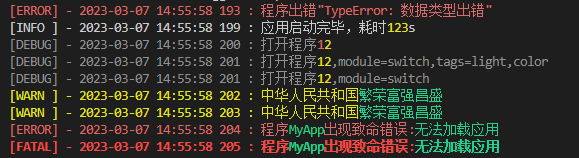

# Transport
## 控制台输出

当实例化`VoerkaLogger`时，内置了一个名称为`console`的控制台输出`Transport`，该内置`Transport`不支持着色输出。
如果需要着色输出，需要安装`@voerkalogger/console`模块。

### 安装

```typescript

> npm install @voerkalogger/console

logger.use("console",new ConsoleTransport() as unknown as TransportBase)

```




- 使用`logger.transports.console`可以访问`console transport`实例
- 使用`logger.transports.console.enabled=false`可以禁用控制台输出


### 配置参数

无
### 自定义模板

默认控制台输出模板字符器为：
`[{levelName}] - {datetime} : {message}{<,module=>module}{<,tags=>tags}`
可以通过`logger.transports.console.format=<新的模板字符串>`来自定义输出。

可用的模板字符串插值变量：

```typescript
{
    message,，                  // 日志信息
    level,                      // 日志级别
    timestamp,                  // 时间戳
    tags,                       // 日志标签
    module,                     // 应用模块名称或源文件
    version,                    // 应用版本号
    app,                        // 应用名称
    sn,                         // 设备序列号
    host,                       // 主机名称
    error,                      // 错误信息
    errorStack,                 // 错误堆栈信息
    errorLine,                  // 错误行数
    levelName,                  // 日志级别名称，如INFO,ERROR
    datetime,                   // 完整的日期时间，如"2023-03-08 10:05:07 371"
    date,                       // 日期,如2023-03-08
    time,                       // 时间 10:05:07
    // ..其他额外的信息
    // ...日志方法传入的额外信息,如logger.debug(msg,var,{a:1,...})
    // ...logger.options.context
}
```
### 插值变量着色

默认情况下，控制台输出会对插值变量按数据类型进行自动着色。

也可以进行自定义着色。

```typescript
logger.info("My name is {#red}","tom")  // tom为红色显示
```

着色输出使用的是[logsets](https://zhangfisher.github.io/logsets)
 

## 文件输出

将日志输出为文件中，适用于`nodejs`

### 安装

```shell
npm install @voerkalogger/file
yarn add @voerkalogger/file
pnpm add @voerkalogger/file

```

### 基本用法

```typescript

import FileTransport from "@voerkalogger/file"

// 安装FileTransport
logger.use("file",new FileTransport({
    location:"日志输出文件夹位置",
    compress: false,
    maxSize: "10k",
    maxFileCount: 5
}) as unknown as TransportBase )

```

### 配置参数

- `location`: 日志文件保存位置，可以是相对路径或绝对路径。
- `maxSize`: 日志文件会按`maxSize`指定的尺寸进行分割。`maxSize`使用`flex-tools/misc/parseFileSize`函数进行解析，可以使用如`8113`,`5M`,`1.2GB`,`1024K`之类的语法。
- `maxFileCount`: 指定保存日志文件的个数，超出日志会被移除。
- `compress`: 是否对日志文件进行压缩,启用后会将日志文件压缩为`zip`文件以节省空间。
- `encoding`: 文件编码，默认是`utf8`

### 自定义输出

默认情况下，`FileTransport`会按照`format="[{levelName}] - {datetime} : {message}{<,module=>module}{<,tags=>tags}"`模板进行插值后进行输出，如果不能满足要求，则可以自行进行扩展。方法如下：

- 直接修改`format`参数，`format`参数是一个模板字符串，支持的插值变量可参照`console`。
- 传入`format`函数：

    ```typescript
    // 安装FileTransport
    logger.use("file",new FileTransport({
        format:(record:VoerkaLoggerRecord,vars: LogMethodVars)=>{
            return " [{datetime}] {levelName} - : {message}"
        }
    }) as unknown as TransportBase )
    ```

### 文件分割

`FileTransport`将日志按`maxSize`指定的大小进行自动分割成`maxFileSize`个日志文件，形成如下：

- `1.log`       **最新**
- `2.log`
- `3.log`
- `4.log`
- `5.log`       **最旧**    

如果`compress=true`启用了压缩功能，则：

- `1.log`       **最新**
- `2.log.zip`
- `3.log.zip`
- `4.log.zip`
- `5.log.zip`   **最旧**    

**说明:**

- 能自定义日志文件名称吗？`不能`
- 目前只支持按文件大小进行分割的策略，不支持按日期进行分割。


## HTTP输出

将日志提交到远程HTTP日志服务器,适用于`nodejs`和`browser`。

### 安装

```shell
npm install @voerkalogger/http
yarn add @voerkalogger/http
pnpm add @voerkalogger/http

```

### 基本用法

```typescript

import HttpTransport from "@voerkalogger/http"

// 安装FileTransport
logger.use("http",new HttpTransport({
    url:"/log",          // 提供地址
    method   : 'post',                      // 访问方法
    contentType : 'application/json',
    //....所有axios.create配置参数
}) as unknown as TransportBase )

```

### 自定义格式

`HttpTransport`默认是提交`JSON`格式的`VoerkaLoggerRecord`数据，也可以自定义。

```typescript

import HttpTransport from "@voerkalogger/http"

interface  CustomLoggerRecord extends VoerkaLoggerRecord{
    a?:string
    b?:number
}

// 安装FileTransport
logger.use("http",new HttpTransport<CustomLoggerRecord>({
    url:"/log",          // 提供地址
    method   : 'post',                      // 访问方法
    contentType : 'application/json',
    //....所有axios.create配置参数
    format:(record:CustomLoggerRecord,vars: LogMethodVars)=>{
        return {
            ...record,
            a:"hello",
            b:1
        }
    }
}) as unknown as TransportBase )

```
